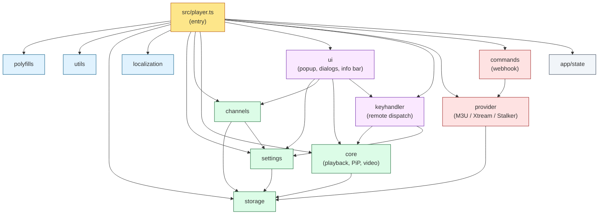
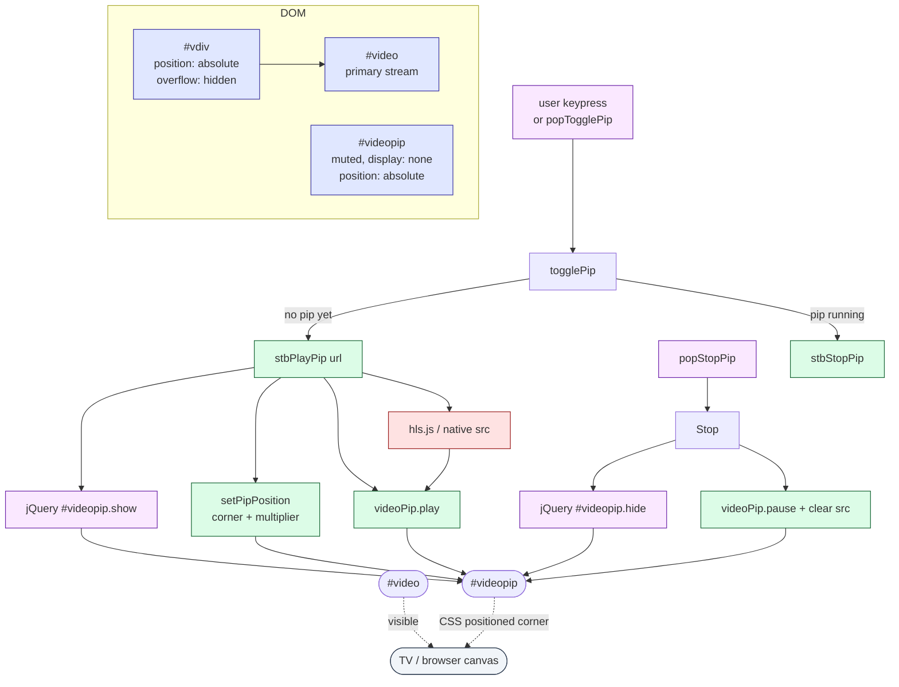
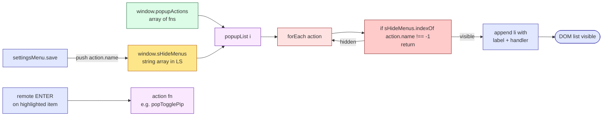
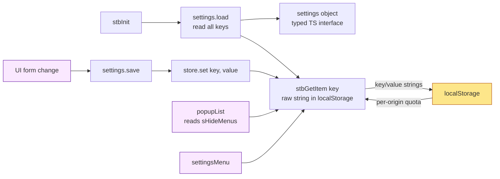
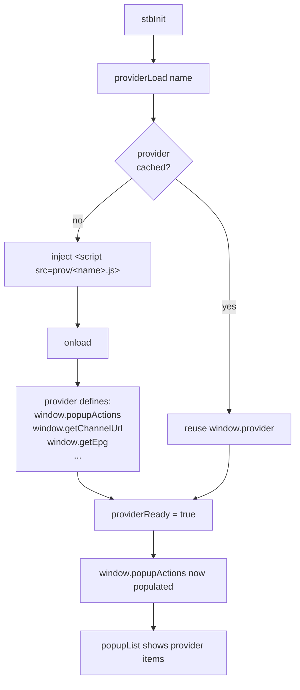
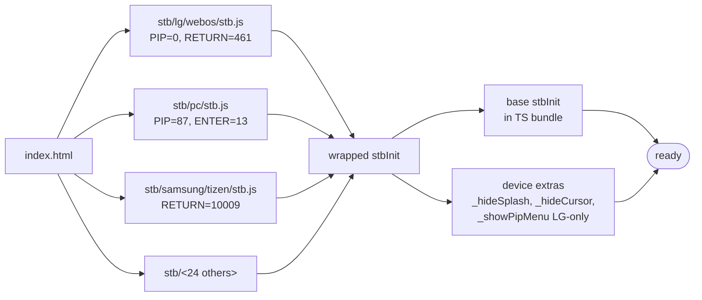
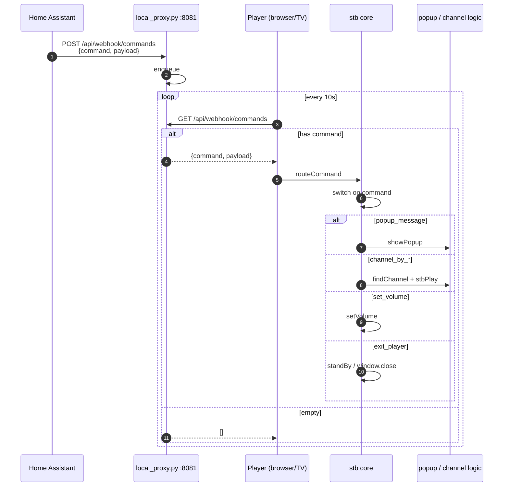
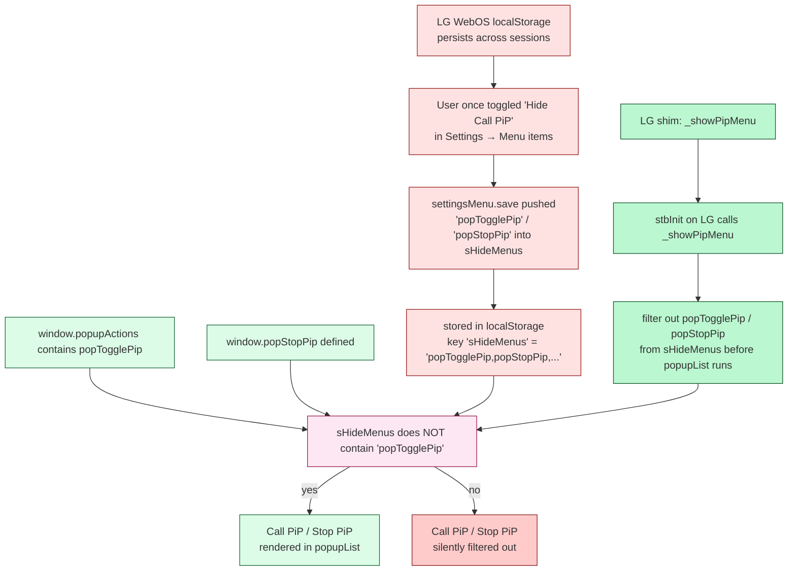
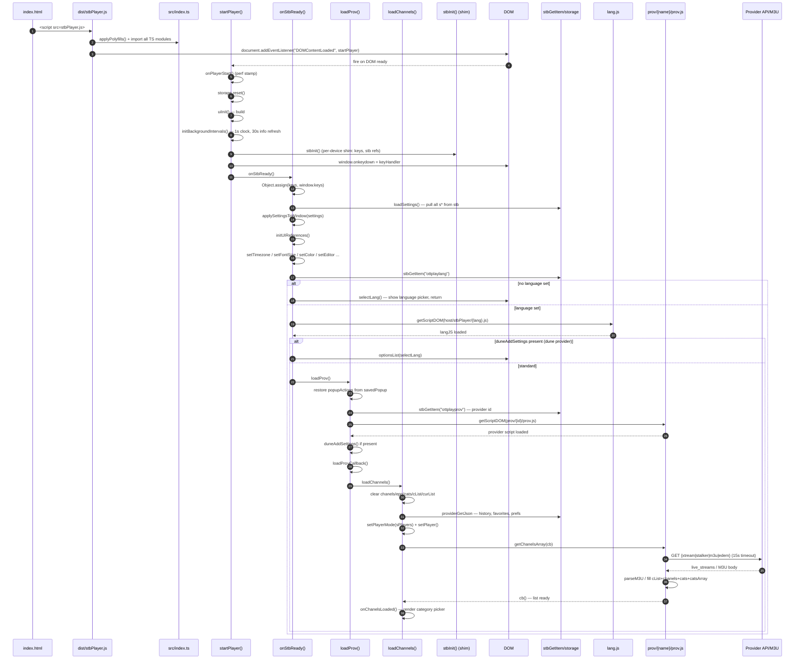
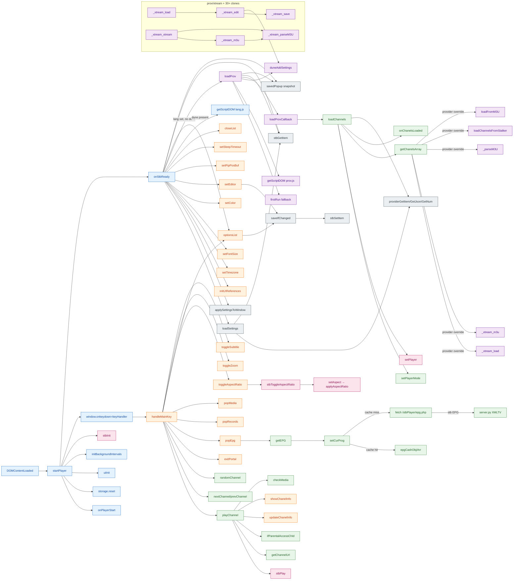

# ottplay-foss — Architecture

End-to-end view of the player: how the browser bundle is loaded, how a key press becomes a stream playing, and how the Picture-in-Picture feature is wired across platforms.

Diagrams are written in [Mermaid](https://mermaid.js.org/). They render natively on GitHub, in VS Code (with the Mermaid extension), and in any standard artifact viewer.

---

## Table of contents

1. [High-level runtime](#1-high-level-runtime)
2. [Startup sequence](#2-startup-sequence)
3. [Module dependency graph](#3-module-dependency-graph)
4. [Key press → action flow](#4-key-press--action-flow)
5. [Channel tuning pipeline](#5-channel-tuning-pipeline)
6. [Picture-in-Picture (PiP)](#6-picture-in-picture-pip)
7. [Popup menu rendering and `sHideMenus` filter](#7-popup-menu-rendering-and-shidemenus-filter)
8. [Settings persistence](#8-settings-persistence)
9. [Provider script load](#9-provider-script-load)
10. [Platform shim layer (per-device `stb.js`)](#10-platform-shim-layer-per-device-stbjs)
11. [Push command / webhook path](#11-push-command--webhook-path)
12. [Why "Call PiP" is hidden on LG WebOS](#12-why-call-pip-is-hidden-on-lg-webos)
13. [EPG — XMLTV load and per-channel lazy fetch](#13-epg--xmltv-load-and-per-channel-lazy-fetch)
14. [Archive / timeshift playback](#14-archive--timeshift-playback)
15. [Per-provider data flows](#15-per-provider-data-flows)

---

## 1. High-level runtime

The player is a single-page web app. The host (browser or TV runtime) loads one HTML file that pulls a pre-built `dist/stbPlayer.js` bundle. The bundle is a concatenation of the compiled TypeScript modules and a platform shim from `stb/<device>/stb.js`. Provider scripts are fetched separately and wired in at runtime.

```mermaid
flowchart LR
    User([User / remote / keyboard])
    Host{{Browser or TV runtime}}
    HTML[index.html<br/>device detection]
    Bundle[dist/stbPlayer.js<br/>~one big IIFE]
    Shim[stb/&lt;device&gt;/stb.js<br/>keys + stbInit]
    TS[TypeScript modules<br/>src/]
    Prov[prov/*.js<br/>provider script]
    LS[(localStorage / cookies)]
    Stream[(HLS / DASH source)]
    Backend[local_proxy.py<br/>HA webhook]

    User -- key event --> Host
    Host --> HTML
    HTML --> Bundle
    Bundle -. sourced from .-> TS
    Bundle -- 2nd chunk .-> Shim
    HTML -- async --> Prov
    Bundle <--> LS
    Bundle --> Stream
    Bundle -. every 10s .-> Backend
    Backend -- POST command --> Bundle
```

---

## 2. Startup sequence

`stbInit` is the first entry point after the bundle is parsed. The platform shim owns it, so the chain is: `index.html` → `stbInit()` (shim) → base `stbInit()` (core) → DOM wiring → provider load.

```mermaid
sequenceDiagram
    autonumber
    participant HTML as index.html
    participant Shim as stb/&lt;device&gt;/stb.js
    participant Core as src/core/index.ts
    participant UI as src/ui/index.ts
    participant Keys as src/keyhandler/index.ts
    participant Prov as prov/&lt;name&gt;.js
    participant LS as localStorage

    HTML->>Shim: include script tag
    Shim->>Shim: detect webOS / Samsung / etc.
    Shim->>Core: stbInit()
    Core->>Core: create #vdiv, #video, #videopip
    Core->>UI: build DOM lists, dialogs
    UI->>Keys: install keydown / keyup listeners
    Core->>LS: read settings (stbGetItem)
    Core->>Prov: dynamic &lt;script&gt; injection
    Prov-->>Core: defines popupActions, channels
    Shim-->>Core: _showPipMenu() (LG only)
    Core->>LS: prune sHideMenus of PiP entries
```

Key observation: **the platform shim runs first, then the base `stbInit` runs again from inside the shim's wrapped function**. This is how per-device code (`_showPipMenu`, `_hideSplash`, etc.) is forced to execute even though `index.html` only knows about one `stbInit` symbol.

---

## 3. Module dependency graph

`src/player.ts` is the entry point. It imports from every other module and re-exports the symbols onto `window.*` for backward compatibility with the legacy `stbPlayer.js` global-namespace design.



---

## 4. Key press → action flow

The remote control key is normalised to a numeric key code, then dispatched through a priority chain. The first handler that returns `true` wins; the rest are skipped.

```mermaid
flowchart TD
    Event([keydown / keyup]) --> Normalise[stbEventToKeyCode]
    Normalise --> Dispatch[keyHandler]
    Dispatch --> Mode0{dialog box<br/>active?}
    Mode0 -- yes --> DBH[dialogBoxKeyHandler]:::handler --> Return1([return])
    Mode0 -- no --> Mode1{about / list<br/>visible?}
    Mode1 -- yes --> List[listKeyHandlerFn]:::handler --> Return2([return])
    Mode1 -- no --> Mode2{edit /<br/>select box?}
    Mode2 -- yes --> Edit[virtual keyboard handler]:::handler --> Return3([return])
    Mode2 -- no --> Mode3{list<br/>open?}
    Mode3 -- yes --> List
    Mode3 -- no --> Main[handleMainKey<br/>(page-specific)]:::handler

    Main -- popup visible --> Popup[popupList handler]
    Main -- playback --> Playback[stbPlay / stbPause / stbStop]
    Main -- EPG / favs / hist --> View[open list view]
    Main -- settings --> Settings[settingsMenu]
    Main -- PiP --> Pip[popTogglePip / popStopPip]
    Main -- unmapped --> Drop([event dropped])

    classDef handler fill:#e0e7ff,stroke:#3730a3
```

`keys` is a per-device keycode table (PC has `PIP: 87`, LG has `PIP: 0` because the remote has no PiP button). `handleMainKey` checks the keycode against this table and forwards to one of the action groups on the right.

---

## 5. Channel tuning pipeline

`stbPlay(url)` is the single entry point for every stream (live channel, VOD, archive, PiP). It picks the right demuxer (HLS.js, Shaka, native), applies the saved volume and aspect, and starts playback.

```mermaid
flowchart LR
    A[Caller<br/>nextChannel / playArchive /<br/>forcePlay / popTogglePip]:::caller
    B[stbPlay url]:::core
    C{url type?}:::decision
    D[stbStop<br/>tear down old stream]:::core
    E[video.src = url<br/>(native HLS on Safari)]
    F[HLS.js<br/>Hls.loadSource]:::ext
    G[Shaka<br/>shaka.Player.load]:::ext
    H[setPipPosition<br/>if PiP]
    I[setMute / setVolume<br/>setAspect]
    J[video.play]:::core
    K[(#video element)]:::dom

    A --> B
    B --> D
    B --> C
    C -- m3u8 / m3u8+query --> F
    C -- mpd --> G
    C -- direct / file --> E
    C -- PiP url --> H
    F --> I
    G --> I
    E --> I
    H --> I
    I --> J
    J --> K
    F --> K
    G --> K
    E --> K

    classDef caller fill:#fef3c7,stroke:#92400e
    classDef core fill:#dcfce7,stroke:#166534
    classDef ext fill:#fee2e2,stroke:#991b1b
    classDef decision fill:#fce7f3,stroke:#9d174d
    classDef dom fill:#e0e7ff,stroke:#3730a3
```

A second stream (PiP) reuses the same demuxer logic but writes to `#videopip` instead of `#video`. See diagram 6.

---

## 6. Picture-in-Picture (PiP)

PiP is **purely a CSS overlay** in this player — there is no `luna://com.webos.service.pip` call and no second window. The same browser engine renders two `<video>` elements stacked on top of each other.



Notes:

- `#videopip` is created lazily by `stbInit` (see `core/index.ts:679`).
- `setPipPosition` honours the `PipSize` setting (small / medium / large) and the `PipPosition` setting (one of four corners).
- On LG WebOS no extra work is required for the overlay — the same Chromium engine paints it.

---

## 7. Popup menu rendering and `sHideMenus` filter

`popupList` is the only place that builds the right-side action menu (Call PiP, Aspect, Audio, Subtitle, Sleep, Reload, ...). The list is filtered by a function-`.name` lookup against `sHideMenus`, an array persisted in `localStorage`.



The filter compares **the function's `.name` property** (which the JS engine preserves for top-level `function foo() {}` declarations) against string entries in `sHideMenus`. Minifiers that produce anonymous expressions break this contract.

---

## 8. Settings persistence

There are two parallel storage layers: a typed `settings` object loaded once at boot, and a per-key `stbGetItem` / `stbSetItem` API that the legacy code uses for fine-grained `localStorage` reads.



On LG WebOS, `localStorage` persists across sessions (until the app is uninstalled or the user clears data). Anything written there — including `sHideMenus` — is therefore "sticky".

---

## 9. Provider script load

Providers are plain JavaScript files under `prov/` that define the playlist format. The player loads them with a `<script>` tag once `stbInit` has finished wiring the core.



If a provider script fails to load, the player falls back to a hard-coded popup list inside `src/provider/index.ts` and continues without M3U/Xtream features.

---

## 10. Platform shim layer (per-device `stb.js`)

The `stb/<device>/stb.js` files are tiny shims that:

1. Override the `keys` table with device-specific keycodes.
2. Wrap the base `stbInit` so device-specific code runs after it.
3. Optionally hide chrome, lock orientation, manage focus, etc.



The shim is concatenated into the final `dist/stbPlayer.js` by `build-concat.cjs`. Only one shim is ever active per build (the device ID is passed at build time or detected at runtime via `?device=lg`).

---

## 11. Push command / webhook path

Commands are queued on a local HTTP endpoint by Home Assistant (or curl) and polled by the player every 10 seconds.



The central server endpoints (`/webhook/poll`, `/webhook/notify`) are intentionally disabled — see the security note in the main README.

---

## 12. Why "Call PiP" is hidden on LG WebOS

This is the exact bug fixed by the recent commit. Three things have to line up, and on LG one of them is wrong.



### Root cause

`popupList` (`src/ui/index.ts:1641`) skips any action whose `action.name` is in `sHideMenus`. The two PiP actions, `popTogglePip` and `popStopPip`, have exactly those names as their function-`.name`. If either name is in the persisted `sHideMenus` array, the entry is filtered before the DOM is touched — so the menu simply never shows it.

On PC browsers, `localStorage` is cleared when the user closes the tab or the dev server restarts, so a stale `sHideMenus` evaporates between sessions. On LG WebOS, `localStorage` is persisted to disk for the lifetime of the installed app, so once a user (or a misclick in Settings → Menu items) hides the PiP entry, it stays hidden forever unless something explicitly removes it.

### Fix

`stb/lg/webos/stb.js` now defines a `_showPipMenu()` helper that runs at the end of the platform shim's `stbInit`:

```javascript
function _showPipMenu() {
    try {
        if (typeof stbSetItem === "function") {
            var hidden = (stbGetItem("sHideMenus") || "")
                .split(",")
                .filter(function(x) {
                    return x !== "" && x !== "popTogglePip" && x !== "popStopPip";
                });
            stbSetItem("sHideMenus", hidden.join(","));
        }
    } catch (e) {}
}
```

It strips only the two PiP names and leaves every other user preference intact. The function is wired in at the bottom of the wrapped `stbInit`:

```javascript
_hideSplash();
_hideCursor();
_lockLandscape();
_focusApp();
_showPipMenu();
```

### Why this is the right place to fix it

Three alternatives were considered and rejected:

1. **Patch `popupList` to special-case PiP.** Couples the LG UX decision into a shared filter. Breaks the next platform that adds a remote without a PiP key.
2. **Bump `sHideMenus` schema and reset on version change.** A blanket reset hides the real problem and annoys users with legitimately customised menus.
3. **Add a "Show PiP" toggle in Settings.** Most users never open Settings; the bug is invisible to them. The fix has to be invisible too.

The platform shim already runs first and owns per-device quirks (hiding the LG splash, locking orientation, etc.). Pruning a known-bad persistence entry on startup is the smallest possible diff and is co-located with the only other LG-specific hacks.

---

## 13. EPG — XMLTV load and per-channel lazy fetch

EPG data has two sources: a server-side XMLTV feed (served as `/epg/<hash>.json`) and a per-channel lazy fetch (triggered on demand when the user opens the guide). The server-generated EPG covers all channels at once; the per-channel API call fills gaps for providers that supply their own program guide.

### How EPG actually flows

When the user presses the EPG key, `src/ui/index.ts` calls `showEPG()`. The first thing that happens is **name-to-channel matching** — the player needs to know which XMLTV `<channel id="...">` corresponds to which M3U entry. The M3U provider does this lazily by hitting `POST /m3u/match-channels` on `server.py`, which fuzzy-matches channel names against the XMLTV channel list and returns a stable hash. The hash is then the file name of the precomputed EPG slice: `/epg/<hash>.json`.

The M3U provider's `getEPGchanel(chId, cb)` is a thin AJAX call to that JSON file. The server has already parsed the XMLTV, sliced the relevant `<programme>` entries for that channel, and serialised them as `{epg_data: [...]}`. The provider applies a per-channel time-shift offset (`chanels[chId].ts`) and returns the array to the player.

For Xtream and Stalker, the server-side match step is bypassed entirely — the provider itself holds the EPG API. Xtream Codes exposes `get_short_epg` per `stream_id`; Stalker uses a JSON-RPC `get_epg` with `ch_id`, `from`, and `to` epoch bounds. Both return program arrays that the provider reshapes into the player's `EPGEntry[]` shape (with `time` and `time_to` in seconds-since-epoch) and hands back via the callback.

The `doGetCurProg` queue is the throttle: even if the EPG overlay asks for 500 channels at once, only one HTTP request fires per event-loop tick. This is important on Smart TVs where the XMLHTTP request budget is small and bursts of 50 parallel requests will get the network stack killed by the OS.

### Why four cache layers

`epg[chId]` is the hot path — OSD current-program lookup, archive start-time lookups, and the per-channel "now playing" tag all read from here. `epgCashObj[chId]` is a fallback that the legacy code wrote to in parallel; the player reads it when `epg[chId]` is missing, which happens after a partial reload. `epgCashArr` is a list of channel IDs that have been refreshed in this session, used to bulk-reload after provider switch. `epgTimers` is for scheduled wakeups (start recording, switch channel) and is unrelated to the EPG data itself.

### Failure modes

- Server returns empty `epg_data` → provider passes `null` to callback → `setCurProg` writes `null` → OSD shows "No program information".
- Provider API times out (10s `$.ajax({timeout: 1e4})`) → callback receives `null` via `.fail()` → channel falls back to "No EPG".
- XMLTV XML is malformed → `server.py` returns a 200 with `{epg_data: []}`; player silently treats it as empty.

The `.always()` callback in `getEPGchanel` (M3U) ensures the EPG chain always advances, even on error — important because `doGetCurProg` is recursive.

```mermaid
sequenceDiagram
    autonumber
    participant User as User opens EPG
    participant UI as src/ui/index.ts
    participant Ch as src/channels/index.ts
    participant Prov as prov/<name>/prov.js
    participant Cache as epg map<br/>in-memory
    participant Server as server.py

    User->>UI: press EPG key
    UI->>Ch: showEPG()
    Ch->>Ch: build epgList for all channels<br/>curList.forEach(epgList)
    loop per channel (lazy)
        Ch->>Ch: doGetCurProg queue
        Note over Ch: batches all requests,<br/>shifts one per tick
        Ch->>Prov: window.getEPGchanel(chId, cb)
        alt M3U provider
            Prov->>Server: GET /m3u/match-channels
            Note over Server: maps M3U names → channel IDs
            Server-->>Prov: name→id mapping
            Prov->>Server: GET /epg/<hash>.json
            Server->>Server: parse XMLTV, slice by channel
            Server-->>Prov: epg_data JSON
        alt Xtream Codes provider
            Prov->>XtreamAPI: GET /player_api.php<br/>?action=get_short_epg<br/>&stream_id=<id>
            XtreamAPI-->>Prov: {epg_listings: [...]}
        alt Stalker provider
            Prov->>Portal: POST /stalker_portal/api/<br/>{jsonrpc:"2.0",method:"get_epg",<br/>params:{ch_id,from,to,mac}}
            Portal-->>Prov: {result: [{start,end,title,desc}]}
        end
        Prov-->>Ch: epgData: EPGEntry[]
        Ch->>Cache: setCurProg(chId, epgData)<br/>epg[chId] = epgData
        Ch->>UI: render current program in OSD
    end
    Ch->>UI: render full program list
    UI-->>User: EPG overlay visible
```

### EPG cache layers

| Layer | Key | TTL | Used by |
|---|---|---|---|
| `epg[chId]` | chId | forever (until reload) | OSD current program, archive start-time |
| `epgCashObj[chId]` | chId | forever | fallback lookup |
| `epgCashArr` | chId[] | forever | bulk reload guard |
| `epgTimers` | — | per-timer | scheduled wakeups |

`doGetCurProg` is the dispatch engine — it reads the queue, fires one fetch per tick, and chains via `setTimeout(doGetCurProg, 0)` to avoid hammering the network.

---

## 14. Archive / timeshift playback

Archive playback lets the user rewind into a recorded time window (up to `archive_hours` config). Two distinct paths: **EPG-guided** (user picks a program from the guide) and **clock-skip** (manual rewind from live TV).

### EPG-guided archive (the "select a past program" path)

When the user opens the EPG overlay and selects a program whose `rec` field is non-zero (i.e. the channel has an archive template stored in `chanels[chId].caso`), the handler in `src/channels/index.ts` calls `setCurrent(catIdx, chIdx, true)` to mark the selection as archive, then `playArchive(item.time)` with the program's start timestamp.

`playArchive` is the core archive entry point. It looks up the current program (`epgArray[curProg]`), calls the provider's `getArchiveUrl` to expand the `${start}`/`${end}` token template into a real URL, and then either **reuses** the existing stream (if the program is a continuation of the current one) or **forces a fresh playback** via `stbPlay(url, offset)`. The `forcePlay = true` flag tells the player to ignore the "same channel" optimisation.

### Clock-skip (the "press RW from live TV" path)

If the user presses the rewind key while watching live, the player calls `timeShift(N)` with N seconds. The implementation differs by provider:

- If the EPG helper is available (`window.getEPGchanelCurCached` returns a result), the player finds the program airing `N` seconds before now and calls `playArchive(progStart)`.
- If no EPG data is cached (e.g. the user has never opened the guide), the player falls back to `playArchive(Date.now()/1000 - N)`, which works as long as the channel has an archive template — the server handles the catchup logic via the same `${start}` token.

This dual path is the same code (`playArchive`) but with different ways of computing the start timestamp. Once the start time is known, the URL building and playback are identical.

### The `caso` template

Each provider stores an archive URL template per channel. The template is set during channel load:

- **M3U**: parsed from the `tvg-rec` attribute on the M3U entry (or auto-detected from the URL pattern: flussonic, nginx-ts, HLS timeshift).
- **Xtream**: built from the `timeshift_duration` field returned by `player_api.php` — typically `server/streaming/timeshift.php?...&start=...&duration=...`.
- **Stalker**: stored as `cmd` field on each channel from the `get_channels` response, which already contains the URL template.

If `caso` is empty, `getArchiveUrl` returns `""` and the player disables the archive menu entry for that channel — silently, without an error.

### The token-substitution regex

`getArchiveUrl` runs five `.replace()` calls on the template, in order:

```javascript
.replace(/\${start}/g, Math.floor(r))
.replace(/\${end}/g, Math.floor(t))
.replace(/\${timestamp}/g, Math.floor(Date.now() / 1e3))
.replace(/\${offset}/g, Math.floor(Date.now() / 1e3) - Math.floor(r))
.replace(/\${duration}/g, Math.floor(t - r))
```

`r` is the archive start (epoch seconds), `t` is the archive end (defaulted to `Date.now()/1000` if not passed). The `g` flag means every occurrence in the template is replaced, not just the first. The template can use any combination of the five tokens — most providers only use `${start}` and `${end}`.

### Live return

`stopArchive()` resets `playType = 0`, sets `forcePlay = true`, and calls `playChannel(catIdx, primaryIdx)` to replay the live stream. The OSD shows "LIVE" again and the archive OSD disappears.

```mermaid
flowchart LR
    subgraph EPG guided
        A1[User opens EPG] --> A2[selects past program]
        A2 --> A3{item.rec > 0 ?}
        A3 -- no --> A4[show program info]
        A3 -- yes --> A5[closeList + setCurrent]
        A5 --> A6[playArchive(item.time)]
    end

    subgraph Clock-skip
        B1[User presses RW key] --> B2[timeShift(N)]
        B2 --> B3{N EPG helper ?}
        B3 -- yes --> B4[playArchive(now-N)]
        B3 -- no --> B5[playArchive(Date.now()-N)]
    end

    subgraph Core
        C1[playArchive unix_ts]
        C1 --> C2{fileArchive<br/>same program?}
        C2 -- yes --> C3[seek within stream]
        C2 -- no --> C4[window.getArchiveUrl]
        C4 --> C5[build URL<br/>${start} ${end} tokens]
        C5 --> C6[stbPlay url offset]
    end

    A6 --> C1
    B4 --> C1
    B5 --> C1
    C3 --> Out[(#video<br/>seeked)]
    C6 --> Out
```

### Archive URL template substitution

All three providers share the same token-substitution pattern in `getArchiveUrl(chId, start, end)`:

```
${start}     → Math.floor(start_epoch_seconds)
${end}       → Math.floor(end_epoch_seconds)
${timestamp}  → Math.floor(now)
${offset}    → Math.floor(now - start)
${duration}  → Math.floor(end - start)
```

Example (flussonic-style):
```
Original:  https://cdn.example.com/mpegts/{ch}/archive-{start}-{end}.ts
Rendered:  https://cdn.example.com/mpegts/42/archive-1725000000-1725003600.ts
```

The provider stores the template in `chanels[chId].caso`. If `caso` is empty the channel has no archive support and `getArchiveUrl` returns `""`.

### State during archive playback

| Variable | Meaning |
|---|---|
| `playType = Math.floor(timestamp)` | archive start time (non-zero = archive mode) |
| `playTime = 0` | offset from start (seeked separately) |
| `forcePlay = true` | force reload even if same channel |
| `archivePos = timestamp` | current playback position |
| `fileArchive = true` | provider has `caso` template |

Return to live: `stopArchive()` → `playType = 0` → `forcePlay = true` → `stbPlay(liveUrl)`.

---

## 15. Per-provider data flows

Every provider exposes the same API surface to the player core. The player never calls provider-specific URLs directly — it calls `window.getChannelUrl`, `window.getArchiveUrl`, `window.getEPGchanel`, `window.getChanelsArray` and the provider implements them.

```mermaid
flowchart TD
    subgraph Core["src/channels/index.ts / src/core/index.ts"]
        PL[loadChannels]:::core
        TU[stbPlay url]:::core
        AR[playArchive ts]:::core
        EP[doGetCurProg]:::core
        PL --> EP
        PL --> AR
        TU --> AR
    end

    subgraph M3U["prov/m3u/prov.js — static playlist"]
        direction TB
        M1[User enters URL<br/>Settings → M3U]:::user
        M2[loadPlaylist<br/>→ loadM3Uparams<br/>→ loadChannels]:::prov
        M3[fetch M3U from URL<br/>parse EXTINF entries]:::prov
        M4["getChanelsArray callback:<br/>populate chanels{} + cList[]"]:::prov
        M5["getChannelUrl(chId)<br/>→ chanels[chId].url"]:::api
        M6["getArchiveUrl(chId,start,end)<br/>→ subst ${start}/${end}<br/>in chanels[chId].caso"]:::api
        M7["getEPGchanel(chId,cb)<br/>→ GET /epg/<hash>.json<br/>(server: XMLTV → JSON)"]:::api
        M1 --> M2 --> M3 --> M4
        PL --> M2
        TU --> M5
        AR --> M6
        EP --> M7
    end

    subgraph Xtream["prov/xtream/prov.js — Xtream Codes API"]
        direction TB
        X1[User enters<br/>server + username + password]:::user
        X2["getChanelsArray callback:<br/>GET /player_api.php<br/?username=...&password=..."]:::prov
        X3["Parse live_streams + categories<br/>build chanels{} + cats{}"]:::prov
        X4["getChannelUrl(chId)<br/>→ {server}/live/{user}/{pwd}/{stream_id}.m3u8"]:::api
        X5["getArchiveUrl(chId,start,end)<br/>→ subst ${start}/${end}<br/>in chanels[chId].caso"]:::api
        X6["getEPGchanel(chId,cb)<br/>→ GET /player_api.php<br/>?action=get_short_epg<br/>&stream_id=<id>"]:::api
        X1 --> X2 --> X3
        PL --> X2
        TU --> X4
        AR --> X5
        EP --> X6
    end

    subgraph Stalker["prov/stalker/prov.js — Stalker / Ministra portal"]
        direction TB
        S1[User enters<br/>portal URL + MAC]:::user
        S2["stalkerApiCall('handshake', {})<br/>→ POST /stalker_portal/api/<br/>{jsonrpc:2.0,method:handshake}"]:::prov
        S2b{response<br/>has token?} -->|no| S3["stalkerApiCall('handshake',<br/>{mac})"]:::prov
        S3 --> S4["stalkerApiCall('get_channels', {})<br/>→ list all channels + genres"]:::prov
        S2 -->|yes| S4
        S4 --> S5[build chanels{} + cats{}<br/>store portal token]:::prov
        S6["getChannelUrl(chId)<br/>→ portal + stream path from chanels[chId].url"]:::api
        S7["getArchiveUrl(chId,start,end)<br/>→ subst in chanels[chId].caso"]:::api
        S8["getEPGchanel(chId,cb)<br/>→ POST /stalker_portal/api/<br/>{jsonrpc:2.0,method:get_epg,<br/>params:{ch_id,from,to,mac}}"]:::api
        S1 --> S2
        PL --> S2
        TU --> S6
        AR --> S7
        EP --> S8
    end

    classDef user fill:#fef3c7,stroke:#92400e
    classDef prov fill:#fde8d8,stroke:#c2410c
    classDef api fill:#dbeafe,stroke:#1e40af
    classDef core fill:#dcfce7,stroke:#166534
```

### Auth comparison

| Provider | Auth method | Session token | Channel list endpoint |
|---|---|---|---|
| M3U | None (public URL) | — | `GET <playlist_url>` |
| Xtream Codes | username + password | URL param (every request) | `GET /player_api.php?...&action=get_live_streams` |
| Stalker | MAC address + handshake | `stalker.token` (expires) | `POST /stalker_portal/api/` JSON-RPC `get_channels` |

Stalker is stateful — the token expires. `stalkerApiCall` auto-injects `mac` into every request and the `handshake` step refreshes the session. Xtream Codes is stateless — credentials are URL params, no session.

### M3U — the simplest case

The user pastes a playlist URL into Settings → M3U. The provider stores it in `providerGetItem("m3uArr")` (JSON-serialised). On every channel list refresh, the provider fetches the URL with `$.ajax({dataType: "text"})`, parses the M3U / EXTINF format line-by-line, and builds the `chanels{}` and `cats{}` maps. There is no auth, no handshake, no token — the playlist is either public or it's not.

The hash for each channel is `xxHash32S(name, true)` — a 32-bit hash of the channel name, returned as a hex string. This becomes the channel ID. The URL is stored verbatim in `chanels[h].url`. If the M3U entry has a `tvg-rec` attribute, it's stored in `chanels[h].caso` as the archive template; otherwise the provider auto-detects by URL pattern (flussonic, video.m3u8, mono.m3u8, etc.).

EPG for M3U is **server-side**: the player's `server.py` parses the user's XMLTV feed, maps channel names to M3U entries, and pre-slices the programs per channel. The provider just fetches `/epg/<hash>.json`.

### Xtream Codes — stateless, no session, credentials in URL

Xtream Codes is an HTTP API that returns JSON for every endpoint. The provider stores `server`, `username`, `password` in `providerGetItem("xtream_data")`. There is no login step — every request is a `GET /player_api.php?username=...&password=...&action=...`.

The channel list endpoint returns three arrays: `categories` (id → name), `live_streams` (id → name + stream_id + icon), and the channels are built by joining them. The stream URL is computed from the credentials: `{server}/live/{username}/{password}/{stream_id}.m3u8` — the player never calls a separate "get stream URL" endpoint.

EPG is per-channel: `get_short_epg&stream_id=<id>` returns up to a few programs around now. The provider reshapes the `epg_listings` array (with ISO timestamps) into the player's `time`/`time_to` shape and hands it back.

Archive uses the same `${start}` template pattern, but the template itself is built from `timeshift_duration` rather than read from a per-channel field.

### Stalker / Ministra — stateful JSON-RPC with MAC auth

Stalker portals (used by IPTV providers running Ministra middleware) are the most complex. Auth is by **MAC address** (a fake one, since STBs don't have a real MAC). The portal expects:

1. A `handshake` JSON-RPC call to establish a session and receive a token.
2. Subsequent calls include the MAC and the token (the token is injected by the portal middleware from the `Cookie` header on the response).

The provider's `stalkerApiCall(method, params, callback)` builds a JSON-RPC envelope (`{id, jsonrpc, method, params}`), injects the MAC, and POSTs to `{portal}/stalker_portal/api/`. The `loadChannelsFromStalker` sequence is:

1. `handshake` with no MAC — fails (most portals require a MAC).
2. Retry `handshake` with the stored MAC — succeeds, server returns a token via `Set-Cookie` header.
3. `get_channels` returns a flat list of channels with their `cmd` field (the stream URL) and `tv_archive_duration` (archive support).
4. Provider maps channels to categories by `ch.genre` field and stores the `cmd` template in `chanels[h].caso`.

EPG is per-channel JSON-RPC: `get_epg` with `ch_id`, `from` (24h ago), `to` (24h ahead), and MAC. The response is `r.result` (not `r.epg_listings` like Xtream), and the program timestamps are unix seconds not ISO strings.

Stalker portals also implement server-side rate limiting and token expiry. The provider doesn't currently auto-refresh the token — when it expires, the next call returns an error and the channel list shows "Connection failed" until the user re-enters the portal URL.

### How providers stay interchangeable

The player core never branches on provider type. Every provider implements the same four functions:

- `getChannelUrl(chId)` → returns the playable stream URL.
- `getArchiveUrl(chId, start, end)` → returns the archive URL with tokens expanded.
- `getEPGchanel(chId, callback)` → calls callback with `(chId, EPGEntry[] | null)`.
- `getChanelsArray(callback)` → populates `chanels{}` and `cats{}`, then calls callback.

The provider also adds its own entries to `popupActions` (settings menu, reload, etc.) via `duneAddSettings`. The player's `popupList` filter hides these if the provider script failed to load (see the `typeof w.stbPlayPip === "function"` pattern in the player code — same idea, applied to the provider).

If a new provider is needed, drop a `prov/<name>/prov.js` file with the four functions, add a `duneAddSettings` entry, and the player picks it up on next reload. No core changes required.

---

## Appendix: file map

| Concern | File |
|---|---|
| Bundle entry | `index.html` |
| TS entry | `src/player.ts` |
| Playback / PiP | `src/core/index.ts` |
| Remote dispatch | `src/keyhandler/index.ts` |
| Popup menu / filter | `src/ui/index.ts:1563` (build) and `src/ui/index.ts:1634` (filter) |
| Settings persistence | `src/settings/index.ts` (load `sHideMenus` L285, store L429) |
| LG shim | `stb/lg/webos/stb.js` |
| PC shim | `stb/pc/stb.js` |
| M3U provider | `prov/m3u/prov.js` |
| Xtream provider | `prov/xtream/prov.js` |
| Stalker provider | `prov/stalker/prov.js` |
| EPG server side | `server.py` (XMLTV parse → JSON) |
| Local webhook proxy | `local_proxy.py` |
| Build | `build-concat.cjs` |
| Local webhook proxy | `local_proxy.py` |

---

## 16. Startup sequence (mermaid)

Bootstrap chain from `<script>` load through first channel render. Source: `src/index.ts:1278` (`startPlayer`), `src/index.ts:1335` (`onStbReady`), `src/provider/index.ts:775` (`loadProv`), `src/provider/index.ts:1092` (`loadChannels`).



---

## 17. Function call dependency graph (mermaid)

Edges = direct call. Grouped by module. Built from graphify `graphify_callees` / `graphify_callers` traces.


