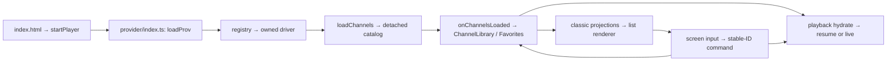

# Player architecture

This is the developer entry point for the runtime shipped by `ottplay-foss`.
It describes ownership and integration contracts, not a second implementation
plan. The [runtime migration record](runtime-ownership-migration.md) records
completed changes and measurements. Subsystem documents linked below contain
their storage formats and detailed compatibility behavior.

The application has two relevant representations: TypeScript source modules and
an ordered, classic ES5 script. An ES module import graph alone does not describe
the shipped runtime. [The classic module manifest](../scripts/classic-bundle.cjs),
HTML bootstrap, published globals, device scripts and distribution filters also
determine what runs.

## Where state belongs

- **Provider connection and catalog:** [provider/runtime.ts](../src/provider/runtime.ts)
  owns provider and catalog generations. [provider/drivers.ts](../src/provider/drivers.ts)
  supplies the registry, injected ports and classic host bindings. Family drivers
  own credentials, requests and private catalog data. A catalog returned to the
  host is detached from that private state.
- **Channel library:** [channels/library.ts](../src/channels/library.ts) owns user
  groups, membership, selection, locks and playback preferences.
  [classic-library.ts](../src/channels/classic-library.ts) projects this state into
  `cats`, `catsArray`, `curList` and numeric positions. Favorites have their own
  source-scoped owner in [favorites-lists.ts](../src/channels/favorites-lists.ts).
  See [Channel library](channel-library.md).
- **Screens and input:** [screen-controller.ts](../src/ui/screen-controller.ts)
  owns screen models and disposal; [input-router.ts](../src/ui/input-router.ts)
  dispatches commands. [classic-screen-port.ts](../src/ui/classic-screen-port.ts)
  owns the retained list/editor/modal properties. `ui/index.ts` still renders
  DOM and `keyhandler/index.ts` retains device input integration. See
  [Screen ownership](screen-ownership.md).
- **Settings and access:** [settings/store.ts](../src/settings/store.ts) owns
  validated values and drafts; [settings/index.ts](../src/settings/index.ts)
  declares IDs, scopes, storage codecs and effects. `settings` and `window.s*`
  accessors address that store. [access/session.ts](../src/access/session.ts)
  owns parental grants and requests, with device/UI translation in its classic
  adapter. See [Settings](settings-store.md) and [cloud transfers](cloud-settings.md).
- **Playback intent and persistence:** [playback/session.ts](../src/playback/session.ts)
  owns target, phase, position, generation and pending seeks. Its classic adapter
  translates legacy modes and coordinates [journal.ts](../src/playback/journal.ts).
  [archive.ts](../src/playback/archive.ts) owns guide/authorization/URL work for
  archive playback. See [Playback and provider lifetimes](playback-session-architecture.md).
- **Media navigation:** [media/library.ts](../src/media/library.ts) owns catalog
  frames, selection and resolution. [media/journal.ts](../src/media/journal.ts)
  owns history/favorites and positions. The classic adapter publishes renderer
  projections and calls provider media codecs. See [Media library](media-library.md).
- **Guide and reminders:** [guide/service.ts](../src/guide/service.ts) owns request
  coalescing, queue/cache, subscriptions and the transition clock;
  [screen.ts](../src/guide/screen.ts) owns programme selection;
  [reminders.ts](../src/guide/reminders.ts) owns durable reminders and their timer.
  See [Guide architecture](guide-architecture.md).
- **Decoder resources:** [device/media-backend.ts](../src/device/media-backend.ts)
  owns main/PiP leases. [core/index.ts](../src/core/index.ts) supplies managed
  HLS, Shaka and HTML media effects. Retained `stb/<device>/stb.js` scripts can
  instead supply their hardware transport. [device/adapter.ts](../src/device/adapter.ts)
  is their explicit ingress. See [Media backend](media-backend.md) and
  [device integration](device-media-backend.md).

`OttPlayCore` is the separately distributed Kotlin common core. It supplies
playlist/protocol parsing, catalog and migration identities, guide timeline,
playback plans and durable collection policies. FOSS supplies HTTP, DOM,
storage, clocks and device effects. A shared algorithm change belongs in the
core repository; a host lifetime or rendering change belongs here.

## Control and data flows

### Boot and source loading

[index.html](../index.html) loads the blocking runtime prelude, shared core and
media dependencies. It then loads the player bundle, the selected
`stb/<device>/stb.js`, and calls `startPlayer()`. There is no parallel DOM-ready
auto-start path. A missing shared-core API produces a boot failure, not a local
replacement of that algorithm.



`loadProv()` detaches the old instance before disposal and rechecks its command
token after cleanup. `loadChannels()` starts a separate catalog lifetime,
invalidates transient screens/guide work and hydrates provider settings.
`onChannelsLoaded()` mounts the libraries and restores playback only after
catalog acceptance. Refreshing a projection is different from reloading a
provider catalog.

### Selecting, playing and observing

A list/search/guide callback captures source, catalog, stable item/group identity
and its screen owner. At acceptance, it resolves the current position and checks
parental access. After asynchronous PIN, guide or URL resolution, it checks those
conditions again. A stored row index is never sufficient authorization to act on
a current item.

The classic playback adapter translates the command into live/archive/VOD state.
`stbPlay`, `stbPause`, `stbContinue`, `stbStop` and `stbSetPosTime` remain the device
boundary. Managed engines report observations through their current decoder
lease; those observations update playback state and checkpoints. Reading a
snapshot or drawing an infobar must not sample a decoder, advance its clock or
save storage. Retained hardware adapters have an explicit compatibility sampler.

Archive requests use owned programme identity and time bounds, not `curProg` or
another UI index. File-relative reuse requires the same source, channel,
programme and bounds. Retention and authorization are checked again before
delayed playback. Guide intervals are `[start, end)`; the greatest start wins
an overlap, and equal starts retain input order. These rules come from the
common core, not a renderer's search loop.

Media navigation resolves an item from its origin catalog before playing it.
Signed/resolved URLs are playback data, not media identity. Incremental media
pages and provider guide/logo patches may update a current view without
repeating startup, but may not revive a retired frame or source.

### Saving and restoring

Editors address schema IDs through a draft. Save validates, checks for concurrent
changes, writes and reads back, then publishes values and effects. Cancel does
not write. Portable JSON v2 includes canonical channel/favorites documents;
cloud backups use a separate raw-storage codec and replacement policy.

Import/restore guards bind the source and storage accessors, including checks
after external effects. Rollback is limited to attempted keys still owned by
that operation. Legacy storage is not a crash-safe transaction: rollback can
fail or source replacement can leave a written prefix. Preserve this failure
contract; never replace it with clear-first import or unconditional rollback.

## Lifetimes and identities

[source-identity.ts](../src/provider/source-identity.ts) has three deliberately
different views:

- `legacy(host)` identifies the historical provider namespace, including an M3U
  slot. It is used for compatibility/import claims, not account isolation.
- `current(host)` adds the TV source/account fingerprint. Group names, channel
  order and transient stream URLs are not part of that identity.
- `media(host)` additionally includes the separate media source where needed,
  such as an M3U media portal. Changing only a media source must not relabel TV
  history.

The fingerprint is a storage namespace, not encryption or authentication.
Persist channel/media/programme references, not session objects, cancellation
handles or list positions. A title/URL fallback exists where a provider offers
no stable ID; it cannot promise identity through arbitrary renames or duplicate
reordering.

A **source lifetime** spans one selected provider instance/configuration. A
**catalog lifetime** is shorter: reload replaces accepted channel resources.
A **screen lifetime** is shorter again and may be suspended by an editor or
picker. A **decoder lifetime** follows source, playback target and generation;
group reorder or ordinary renderer republishing must not stop it. The playback
adapter therefore exposes separate UI, backend and source validity checks.

Cancellation follows these rules:

1. Retire the old owner before aborting requests or disposing resources. Abort
   and UI cleanup can synchronously call back or select another source.
2. Guard completion even if transport cancellation succeeded. Late callbacks,
   duplicate completion, queued cleared timers and non-abortable requests are
   tested cases.
3. Recheck admission after storage, translation/rendering and other injected
   effects before publishing the next effect. A check before an external call
   does not authorize actions after a reentrant replacement.
4. Check `foreground()` for input; `active()` alone also admits a suspended
   screen. Replacement retires handlers. Restoring an old function reference
   does not restore its owner: search returns from the category picker by
   creating a new owned handler for the selected stable ID.

Similar method names do not imply interchangeable scope APIs.
`ProviderSession.own(cleanup)` returns a **detach** function that unregisters
cleanup without executing it. `ScreenOwner.own(cleanup)` returns a **release**
function that executes cleanup once and unregisters it. `ScreenOwner.guard`
checks active ownership; `ClassicScreenPort.ownListHandler` also checks foreground
ownership. Playback operation `guard()` cancels the previous pending operation
and allocates a new ticket. Read the relevant implementation before sharing a
lifetime helper between these modules.

## Provider contract and release boundary

[driver-profiles.ts](../src/provider/driver-profiles.ts) is the single managed
inventory: 48 Full profiles, including nested IDs such as `bestlist/stalker`.
Profiles declare `id`, factory family, legacy storage prefix and title. Runtime
capabilities (`archive`, `guide`, `media`, `settings`) belong to driver instances;
they describe available operations, not successful networking, available EPG
data, DRM support or device decoding.

The interfaces at the top of [drivers.ts](../src/provider/drivers.ts) specify
`load`, `stream`, `archive`, `guide`, `logo`, credentials, disposal and optional
current-guide/subscription/storage-key operations. Ports provide transport,
clock, storage, hashing, shared-core calls, XML decoding and device facts.
Transport returns cancellation; family code owns request/reload scopes and
rejects obsolete completions. Accepted catalog results are detached; failed
reloads must not expose old stream addresses. Unsupported/missing routes return
their declared empty result rather than looking up a different channel.

The host mount is a compatibility codec. It publishes `getChannelsArray`,
`getChannelUrl`, guide/archive callbacks and scoped storage accessors. Family
codecs also expose media/settings behavior: do not assume that one capability
Boolean replaces all required hooks. M3U has 15 slots and native XMLTV metadata;
Stalker has MAC authentication; ITV/OTTCLUB/Shura have distinct catalog/guide
phases; media families have origin, cancellation and lazy-page contracts.
See the driver sections of [Playback and providers](playback-session-architecture.md)
and [M3U/VPortal](m3u-vportal.md).

[provider-assets.cjs](../scripts/provider-assets.cjs) derives managed IDs from
that same inventory. [runtime-assets.cjs](../scripts/runtime-assets.cjs) excludes
their old `prov.js` files and `stb/core.js` from delivered roots. They remain
source-controlled historical oracles, not runtime fallbacks. Metadata/logos and
device adapters have separate staging rules.

The external custom-script path in `provider/runtime.ts` still exists. It
serializes script evaluation and scopes supported AJAX/deferred/timer calls.
It cannot undo code already evaluated, arbitrary global writes, saved raw
closures or native Promise continuations. A loader that never reports success
or failure leaves replacement waiting; a timeout alone cannot prove that old
JavaScript will never run. Managed providers do not use this path.

## Public compatibility ABI versus internal code

Public names are consumed as both bare globals and `window` properties by HTML,
device/provider extensions, native wrappers and saved settings. Some menu
identifiers historically derive from function names. Maintain names, arity,
property behavior, callback receivers and immediate initialization ordering.

[compatibility/legacy-names.ts](../src/compatibility/legacy-names.ts) maps readable
source names to retained bindings and settings/action IDs. For example,
`getChannelsArray` is emitted as `getChanelsArray`, and `saveListPanelState` as
`saveCPD`; published English properties remain live aliases. Tests of an emitted
artifact must resolve its actual declarations/publications, not inject source
implementations when an English declaration is absent.

Names describe the effect while the emitted interface stays compatible:

- `observeCurrentProgramme` → `getCurProgData` reports current-programme cache
  availability and owns an asynchronous guide subscription; it is not a pure
  getter and a true return does not imply an immediate callback.
- `publishChannelProgrammeRows` → `setCurProg` updates the now/next projection.
  It does not replace the full-schedule cache owned by the guide service.
- `moveSelectedChannelOrCategory` → `moveChannel` retains the global entrypoint
  for group or membership ordering. `removeSelectedChannelFromCategory` →
  `deleteChannel` removes category membership, not the shared catalog channel.

The `__ott*` APIs in `CLASSIC_PRIVATE_MODULES` are explicit internal integration
boundaries. Their implementation bindings are local to immediate scopes; the
publication itself is still observable and its callers must be audited.
Modules outside that list retain classic shared scope. `src/app/state.ts` is an
ESM mirror, **not** a shipped state owner: only its three explicit popup bridges
are admitted by the linker. Adding it to the manifest would reset shared arrays.

[window-globals.md](window-globals.md) is a historical inventory, not a complete
current contract or a proof that a name is removable. Use actual publications,
the legacy-name map, linker manifest, identifier gate and behavior tests together.
Renaming a private variable does not replace an algorithm or remove a state
owner. Preserve attribution and licenses; see [provenance](legacy-provenance.md).

## Build, distributions and shared-core updates

The [Vite pipeline](../vite.config.ts) compiles TypeScript with target ES5 and
module ES2015, then the [classic linker](../scripts/classic-bundle.cjs) removes
module syntax using bound symbols in `CLASSIC_MODULES` order. Named imports stay
live. Unlisted dependencies, unsupported imports and invalid private-module
references fail the build. Private modules publish through their declared
window boundary; adding a TypeScript file alone does not ship it.

[classic-optimizer.cjs](../scripts/classic-optimizer.cjs) preserves top-level
bindings, property names, function names/arity and legacy engine semantics.
Do not enable unsafe rewrites, property/top-level mangling, assumed-pure getters
or argument rewrites to meet a byte target. ES5 syntax does not supply missing
APIs: the blocking runtime prelude and HLS worker prelude are separate assets.
See [Build pipeline](build-pipeline.md), [ES5 compatibility](es5-compatibility.md)
and [dependency upgrades](external-library-upgrades.md).

There are two independent distribution decisions:

- **Runtime environment:** server/retained-device assets use legacy-compatible
  libraries. Tauri and Capacitor staging uses audited npm-locked native-shell
  libraries and system fonts. Application code still targets ES5; native vendor
  bytes have their separate manifest/audit. Compare each final staged artifact,
  not just the server intermediate.
- **Full versus Play frontend policy:** [android-distribution.cjs](../scripts/android-distribution.cjs)
  removes `OTTPLAY_FULL_ONLY` regions and filters providers. Play retains Demo,
  M3U, Stalker and Xtream. This compatibility frontend transform remains in this
  repository; Android APK/AAB creation belongs to `ottplay-android`. Markers must
  survive the distribution compiler step, including TypeScript interface erasure.
  Menu restrictions alone are not proof that excluded code/assets are absent.

[classic-size.cjs](../scripts/classic-size.cjs) is the executable size contract:
654,000 raw bytes and 186,750 gzip-level-9 bytes for each final classic artifact.
It excludes separately loaded media libraries and shared core. The build report
at `build/reports/classic-bundle.json` records modules, optimizer options,
interfaces, hashes and actual sizes. Older measurements in migration documents
are historical baselines, not additional current ceilings.

The core source lives in
[ottplay-core/shared-core](https://github.com/open-ott-play/ottplay-core/tree/main/shared-core).
This repository pins `vendor/ottplay-core.js`, its JAR, license and distribution
manifest. Consumers build without a sibling compiler checkout. For an intentional
core update, run its boundary, JVM/JS and packaged-JS checks, then use its
`scripts/distribute.cjs install-native /absolute/path/to/ottplay-foss` and
`check-native` commands. `install-native` updates both JS and JAR with the same
receipt; `install-web` alone is not a complete update of this vendor directory.
Do not hand-edit generated code or receipt hashes. FOSS's
[shared-core.cjs](../scripts/shared-core.cjs) verifies/stages the web assets;
the core distribution checker verifies the complete consumer artifact set.

## Proving code is dead

A failed text search or an unused TypeScript export is only a lead. Before
removing a runtime binding or excluding a module:

1. Check HTML boot, device routes, bare globals, `window` aliases, native/plugin
   entrypoints, event registrations, indirect property access, generated wire
   contracts and saved menu/callback names. Search original and mapped names.
2. Classify provider code as managed instance, external script integration or
   retained oracle. Check explicit `/f/<adapter>` routes even when local device
   detection never chooses them. HTTP-hosted players can run inside native shells.
3. Trace initialization effects, side-effect imports and mutable alias readers.
   Distinguish an authoritative owner from a compatibility projection before
   removing either. Do not replace a removed owner with a hidden second mirror.
4. Remove the implementation/manifest entry together, retain required fixtures
   and notices, and exercise both cold boot and the formerly reachable operation
   through actual output. Packaging must prove excluded scripts are absent.

Record the call-root evidence and affected tests in the change description.
Historical fixtures should remain immutable. Corrected behavior gets explicit
new assertions or narrowly documented expectation corrections, as in
[playlist-corrected-expectations.cjs](../tests/helpers/playlist-corrected-expectations.cjs).
A smaller source diff or renamed identifier is not proof of runtime independence.

## Making a change

### Add a provider or protocol capability

1. Choose the existing family only if its transport and lifetime contracts match.
   Add the profile/storage prefix in `driver-profiles.ts`, then implement the
   registry factory/ports and optional UI codec. New private modules need explicit
   manifest order and publications. Keep HTTP/DOM effects out of common-core rules.
2. Specify provider IDs, channel IDs, storage scope, empty/error behavior and
   optional guide/media/archive operations. Preserve wire bodies separately from
   display corrections; M3U title hashes and companion payloads are compatibility
   data. Supply a conservative migration when identity changes.
3. Test actual `loadProv`/`loadChannels`, reload, source/account/slot replacement,
   abort reentry, late success/failure, settings cancel and detached snapshots.
   Add protocol fixtures and run the family driver suite. Update packaging and
   Full/Play policy tests so an old script cannot silently become the fallback.

### Add a view or asynchronous command

1. Pick the existing owner and stable target identity. Put effects behind ports;
   do not add a second mutable `window` model. Publish compatibility accessors
   only at the adapter.
2. Bind work to its source/catalog and screen/frame/decoder lifetime as appropriate.
   Preserve suspended parents for overlays. A replacement list gets a new input
   owner; returning from it must deliberately rebind the parent action.
3. Test source and account ABA, reorder, removal, cancelled PIN/editor, close,
   duplicate completion and synchronous reentry. Verify the same user operation
   through source and actual compiled artifacts.

### Change persistence or shared rules

Define the schema/version/scope and importer before adding writes. Retain old
bytes, claim legacy namespaces once, preserve unresolved references, and make
foreign/future/malformed data read-only. Test rejected writes, readback failure,
rollback failure and reset/unload so late callbacks cannot recreate deleted data.
Use core distribution tooling for common algorithms and keep host-specific
normalization at the explicit boundary.

## Verification map

Use Node 22, as in [.github/workflows/ci.yml](../.github/workflows/ci.yml).
Commands are registered in [package.json](../package.json); the
[test inventory gate](../scripts/check-test-inventory.cjs) catches unregistered
tests. Start with the affected source suite, then run the integration gates:

```sh
npm ci --ignore-scripts
npm run typecheck
npm run lint
npm test
npm run check:test-inventory
npm run build
npm run check:bundle
npm run check:es5
npm run check:size
npx playwright install chromium
npm run test:devices:browser
npm run test:native:ui
```

- **Ownership and persistence:** `test:unified` covers provider instances,
  channel library/references, playback/journals, archive, screens/search/access,
  media and guide/reminders. Settings/cloud suites also run in `npm test`.
- **ABI and build:** linker/optimizer/English-name tests check live aliases and
  semantics. `check:bundle` executes emitted code under legacy, modern and
  native/fallback host profiles, including the actual XML and search scopes.
  Bundle tests must not substitute source modules for missing artifact APIs.
- **Assets and old engines:** `check:es5` parses shared scripts and boot code,
  checks retained/staged assets, and audits native manifests. Device tests
  exercise all retained routes and unavailable old APIs. Distribution tests
  assert Full/Play provider/menu/asset separation.
- **Browser behavior:** `test:devices:browser` exercises device routing, real
  media/browser controls and full-player HLS playback. `test:native:ui` checks
  the native frontend's CSP-safe channel list. Controlled network fixtures and
  synthetic unload events are not physical firmware or remote-service testing.

For a Play frontend change, build into separate temporary output/compile roots
with `OTTPLAY_ANDROID_FLAVOR=play`, `OTTPLAY_ANDROID_OUTPUT` and
`OTTPLAY_ANDROID_COMPILE_ROOT`; normal `npm run build` is Full. Run
`npm run test:android:policy`, then
`node tests/test_port_bundle_smoke.cjs /absolute/output/stbPlayer.js --play` and
the affected artifact suites against that output. Keep normal Full outputs
available for the default three-artifact gates.

Before a retained-TV/STB compatibility claim, run the relevant physical-device
smoke procedure in [Mode B](mode-b-device-smoke.md). ES5 parsing, mocked host
APIs, Node/jsdom timing and Chromium decoding establish different properties;
none alone measures startup, memory, codec/DRM support or firmware behavior on
the target device.
