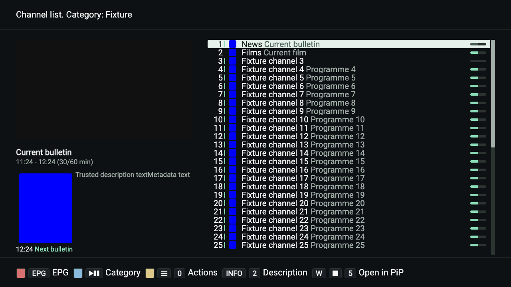

# Studio 2026 and interface settings

Studio 2026 is the default theme for an unset or invalid `sInterfaceTheme`.
Explicitly saved Classic (`0`), PLi-HD (`1`) and Studio (`2`) selections survive
restart. Selecting a theme does not reset any other preference. Custom colour
pickers are labelled **Classic** and select that theme in the same settings draft;
cancelling the draft preserves both the previous theme and colours.

The presentation was developed for OTT-play FOSS in September 2026. It uses
original HTML/CSS, existing player fonts and the established two-panel layout.
[Interface history](interface-history.md) preserves the separate PLi-HD credits,
upstream links and the earlier OTT-play lineage in English.

## Settings contract

- **Rows:** `pageSize` remains 25 by default, with the existing 10–30 range.
  A full page renders exactly the selected count. The final page contains only
  the remaining channels at the same row height. No automatic density preset
  replaces this value.
- **Typography:** all seven saved font indices and the 0–30 line-spacing setting
  remain available. Text size is constrained by the row box, as before, so large
  glyphs cannot push the last configured row off screen. Native builds retain
  their corresponding OS font families.
- **Layout:** list side, reduced-video mode and scrollbar visibility remain
  independent of the theme. The preview and its opaque mask use one shared
  rectangle. Resizing recalculates both row and logo/progress geometry.
  Classic details also stay below the header when reduced video is disabled.
- **Channel information:** number, logo (hidden/square/wide), channel name,
  programme name, progress, archive indication, description, thumbnail and
  upcoming programme count retain their existing controls and provider scope.
  Large upcoming lists scroll inside the available detail space without covering
  the current title. Selecting a channel without current EPG clears old details.
- **Clock and OSD:** all three permanent-clock modes apply on save; the opaque
  clock follows OSD opacity, the transparent clock has no background, and both
  hide while the list is open. Font or window changes preserve the selected
  opacity. The existing 0–10 opacity range is unchanged.
- **Other interface controls:** graphical yes/no/off indicators now read their
  saved setting. Info timing, slide/switch/change/rewind behaviour, PiP, timezone,
  editor choice, remote mappings and hidden-menu IDs keep their existing owners.
  The theme adds no playback, provider or remote-action mapping.

Studio uses graphite `#0e1114`, primary text `#f0f3f1`, secondary text `#a3afa9`
and mint `#8bddb8`. The focused list row uses `#e7f1eb` with dark text `#112119`
and secondary text `#4a6255`. A separate edge mark identifies the current channel;
moving focus does not transfer that mark. Colour-key cues remain visible in the
footer. Studio has no new font download, blur requirement or focus animation.

## Regression coverage

`tests/browser/channel-list-csp.spec.cjs` runs the actual built server and Tauri
renderers in Chromium and WebKit, including Tauri's enforced style CSP.
It covers all three themes, 10/25/30 rows, both sides and both video modes at
900×506, 1280×720, 1920×1080 and 3840×2160 (576 combinations across the two
renderers and two engines). It also tests a mounted-list resize to 640×360,
first-open font sizing, paging, keyboard/pointer focus, asynchronous EPG updates,
all seven font indices, extreme spacing, display toggles, upcoming counts
0/1/20, preview modes, clock modes, opacity 0/3/10 and graphical indicators.

Settings-store and settings-parity tests cover persistence, invalid values,
legacy keys, provider scope, real menu drafts, cancellation and filtered rows.
The existing remote, channel-search, native-font, playback and device suites
remain part of `npm test` / the browser gates.

These are automated browser/runtime checks, not physical-TV certification.
Distance legibility and hardware video-plane placement still need evaluation on
the intended receivers. The checked-in screenshot below uses synthetic channel
and EPG data with the production renderer and factory settings; it is not a
redrawn mockup or a claim about an actual broadcast.

